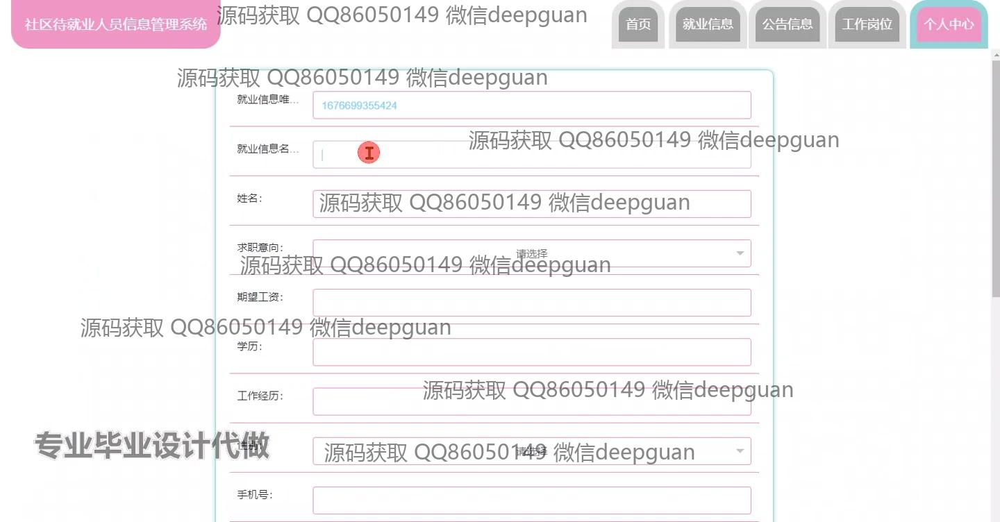
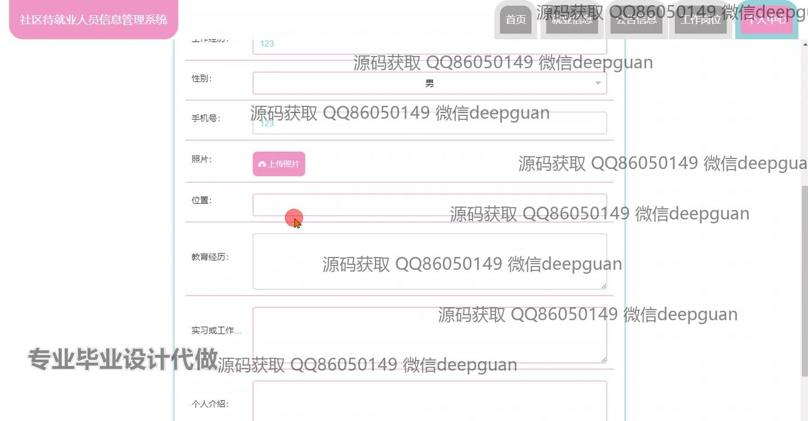
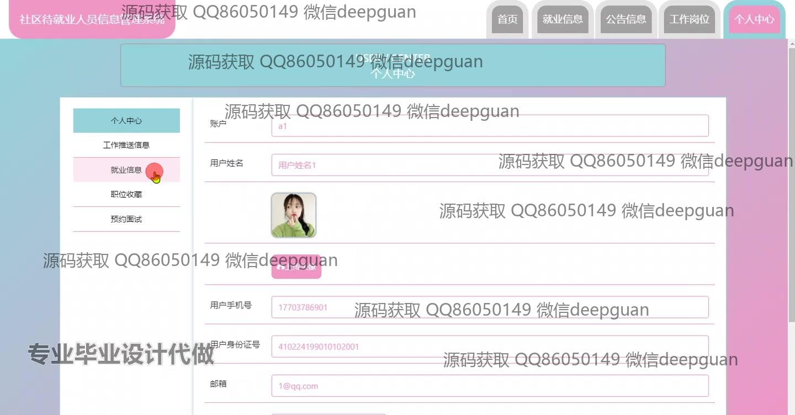
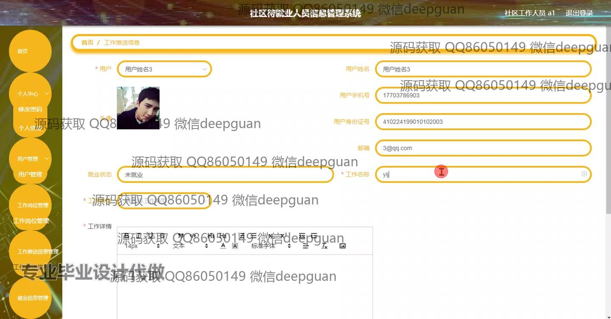
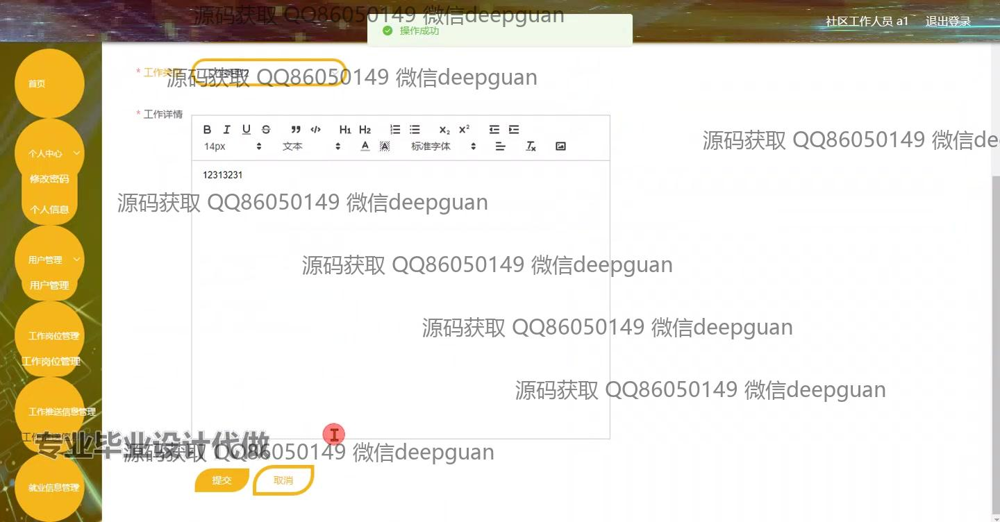
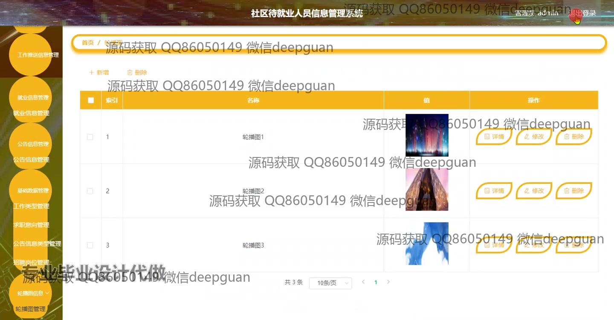

<h1 align="center">社区待就业人员信息管理系统的设计与实现</h1>

## 简介
社区待就业人员信息管理系统：支持管理员和用户角色，可以管理用户和职位信息，实现信息录入、查询、编辑和删除；提供就业信息、公告实时更新，同时支持预约面试、职位收藏和轮播图管理，增强用户体验和信息处理效率。    --计算机毕业设计源码；毕设源码；java毕业设计源码

## 联系方式

<h3 align="center">获取完整代码与数据库文件 + 微信：deepguan QQ: 86050149 QQ群: 783742310</h3>

<h3 align="center">可帮忙远程部署 包运行成功！提供远程部署、修改代码、设计文档指导、代码讲解等服务！</h3>

## 功能介绍（完整见运行截图）
管理员：基本功能包括登录和注册，支持多角色管理，如社区工作人员和用户管理。网站首页设有导航栏，可管理和配置轮播图、公告信息和就业信息。提供职位管理，及用户信息录入、查询、编辑和删除功能。个人中心允许管理员查看和修改个人信息。功能旨在为社区提供高效的待就业人员信息管理。

用户：用户可以通过注册和登录进入系统，访问主页上的导航栏模块。用户界面提供个人中心，用户在此输入和保存个人资料，包括姓名、学历、工作经历、联系方式和就职意向。用户可查看和编辑账户信息，以及预约面试、职位收藏和工作推送信息。旨在帮助待就业人员管理和更新就业信息，优化个人求职资源。

## 运行截图

本代码来源于网络,仅供学习参考使用!

